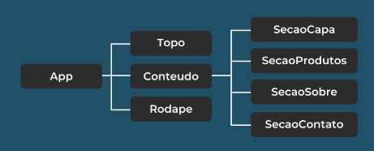
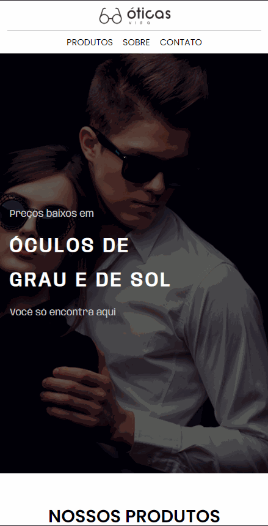

# DESCRIÇÃO
Este projeto de construiruma página web para loja de oculos é um dos desafios que a escola DEVMEDIA propôs para testar os conhecimentos:
* React

## Status do Projeto
Em desenvolvimento

## Etapas
### Etapa 01

### Etapa 02
Estilização dos componentes

## Resultado esperado depois da etapa 02

### Etapa 03
Trabalhar com a responsividade da página

## Resultado esperado depois da etapa 03
